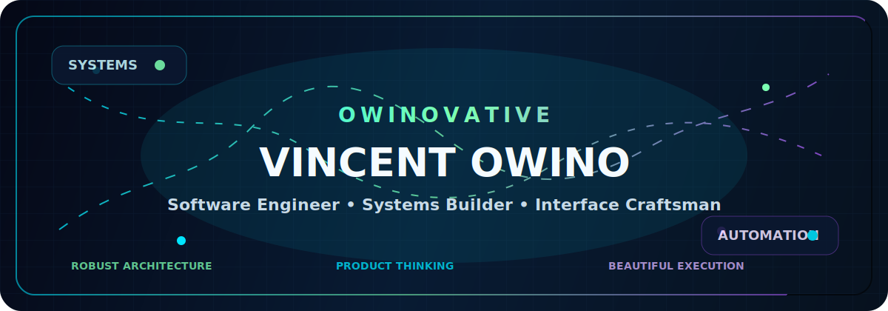

<div align="center">
  
</div>

<div align="center">
  
</div>

<div align="center">
  <a href="https://github.com/Owinovative">
    
  </a>
  
  
  
</div>

---

## 🧠 Identity Matrix

<table>
<tr>
<td width="56%" valign="top">

### **Vincent Owino**
**Software Engineer · Systems Builder · Product-minded Creator**

I design and ship digital products that balance three things:

- **Strength** — robust architecture, maintainable foundations, scalable thinking
- **Beauty** — interfaces that feel intentional, polished, and modern
- **Usefulness** — tools that solve real problems, not just look impressive

My focus is on building **working systems, websites, and powerful tools** that feel professional from the inside out.

</td>
<td width="44%" valign="top">

```txt
┌──────────────────────────────┐
│ OWINOVATIVE // LIVE PROFILE  │
├──────────────────────────────┤
│ Mode:        BUILDING        │
│ Focus:       SYSTEMS         │
│ Quality Bar: PREMIUM         │
│ Energy:      FULL STACK      │
│ Mission:     SHIP IMPACT     │
└──────────────────────────────┘
```

</td>
</tr>
</table>

---

## ⚡ Engineering Command Center

<div align="center">

| Domain | Signal |
|---|---|
| **Frontend** | React, Next.js, responsive UI, polished interaction design |
| **Backend** | Node.js, app logic, data flow, dependable architecture |
| **Product** | Real-world usability, workflow thinking, meaningful outcomes |
| **Automation** | GitHub Actions, repeatable pipelines, developer efficiency |
| **Mindset** | Build boldly. Refine relentlessly. Ship what matters. |

</div>

---

## 🛠️ Tech Arsenal

<div align="center">


<br/><br/>


</div>

---

## 🚀 Featured Build Systems

<div align="center">
  <a href="https://github.com/Owinovative/invinceible_core_hms_v2">
    
  </a>
  <a href="https://github.com/Owinovative/Invinceible_Core">
    
  </a>
</div>

<br/>

<div align="center">

### **Primary Mission Themes**

| Build Theme | Why It Matters |
|---|---|
| **Healthcare systems** | Strong software for serious workflows |
| **Full-stack products** | From interface to logic to delivery |
| **Developer acceleration** | Better tooling, smoother iteration |
| **Premium UX** | Software should feel as sharp as it performs |

</div>

---

## 📊 GitHub Intelligence Deck

<div align="center">
  
  
</div>

<div align="center">
  
</div>

<div align="center">
  
</div>

---

## 🏆 Trophy Wall

<div align="center">
  
</div>

---

## 🌌 Contribution Flow

<div align="center">
  
</div>

---

## 🧬 Builder DNA

```txt
[ CORE SIGNALS ]

▸ Build systems that last
▸ Make the interface feel alive
▸ Prefer clarity over clutter
▸ Ship with technical discipline
▸ Turn ambition into architecture
▸ Turn architecture into impact
```

---

## 🔮 Current Trajectory

<div align="center">

| Signal | Status |
|---|---|
| **Creating** | High-function web products and strong systems |
| **Refining** | Better UX, better structure, better speed |
| **Expanding** | More automation, more intelligence, more leverage |
| **Standard** | Distinctive, polished, unmistakably Owinovative |

</div>

---

## 🌐 Connect

<div align="center">
  <a href="https://github.com/Owinovative">
    
  </a>
</div>

---

<div align="center">

### **“Build strong. Build useful. Build beautifully.”**


</div>
