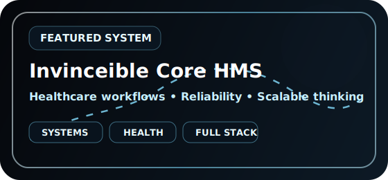
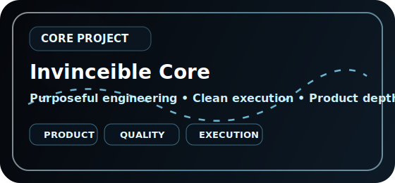

<div align="center">
  
</div>

<div align="center">
  
</div>

<div align="center">
  <a href="https://github.com/Owinovative">
    
  </a>
  
  
  
</div>

<br/>

<div align="center">
  
</div>

---

## 🧠 Executive Profile

<table>
<tr>
<td width="58%" valign="top">

### **Vincent Owino**
**Software Engineer · Systems Builder · Product-minded Creator**

I build digital products around three non-negotiables:

- **Strength** — robust architecture, maintainable foundations, scalable thinking
- **Clarity** — clean interfaces, readable systems, purposeful execution
- **Impact** — tools that solve real problems and feel polished in real use

My focus is creating **working systems, modern websites, and powerful tools** that communicate competence before a user reads a single line of code.

</td>
<td width="42%" valign="top">

```txt
┌──────────────────────────────┐
│ OWINOVATIVE // CONTROL PANEL │
├──────────────────────────────┤
│ Mode:        BUILDING        │
│ Standard:    PREMIUM         │
│ Focus:       SYSTEMS         │
│ Bias:        EXECUTION       │
│ Mission:     SHIP IMPACT     │
└──────────────────────────────┘
```

</td>
</tr>
</table>

---

## ⚡ Capability Grid

| Domain | Signature |
|---|---|
| **Frontend Engineering** | React, Next.js, responsive UI, polished interaction design |
| **Backend Thinking** | Node.js, application structure, dependable logic, data flow |
| **Product Craft** | Real-world usability, workflow clarity, problem-first decisions |
| **Automation** | GitHub Actions, repeatable pipelines, cleaner iteration |
| **Engineering Taste** | Refined visuals without sacrificing reliability |

---

## 🛠️ Tech Arsenal

<div align="center">


<br/><br/>


</div>

---

## 🚀 Signature Builds

<table>
<tr>
<td width="50%" align="center" valign="top">
  <a href="https://github.com/Owinovative/invinceible_core_hms_v2">
    
  </a>
</td>
<td width="50%" align="center" valign="top">
  <a href="https://github.com/Owinovative/Invinceible_Core">
    
  </a>
</td>
</tr>
</table>

### **Why these builds matter**

| Build Theme | Why It Matters |
|---|---|
| **Healthcare systems** | Strong software for serious workflows |
| **Full-stack products** | From interface to logic to delivery |
| **Developer acceleration** | Better tooling, smoother iteration |
| **Premium UX** | Software should feel as sharp as it performs |


---

## 📡 Product Philosophy

<table>
<tr>
<td width="33%" valign="top">

### **01 · Systems**
I care about structure that survives complexity, not just code that works once.

</td>
<td width="33%" valign="top">

### **02 · Interface**
I want products to feel smooth, intentional, and trustworthy at first contact.

</td>
<td width="33%" valign="top">

### **03 · Delivery**
I value momentum: building, refining, and getting useful work into the world.

</td>
</tr>
</table>

---

## 📊 GitHub Activity Snapshot

The unreliable third-party repo and stats image cards were removed so this profile stays clean across GitHub desktop and mobile.

| Signal | Focus |
|---|---|
| **Consistency** | Building, refining, and shipping continuously |
| **Quality** | Prioritizing durable architecture over visual noise |
| **Trajectory** | Expanding systems, websites, and automation depth |
| **Identity** | Distinctive, polished, unmistakably Owinovative |

---

## 🌌 Contribution Flow

<div align="center">
  
</div>

---

## 🧬 Builder DNA

```txt
[ CORE SIGNALS ]

▸ Build systems that last
▸ Make the interface feel alive
▸ Prefer clarity over clutter
▸ Ship with technical discipline
▸ Turn ambition into architecture
▸ Turn architecture into impact
```

---


## 🌐 Connect

<div align="center">
  <a href="https://github.com/Owinovative">
    
  </a>
</div>

---

<div align="center">

### **Build strong. Build useful. Build beautifully.**


</div>

